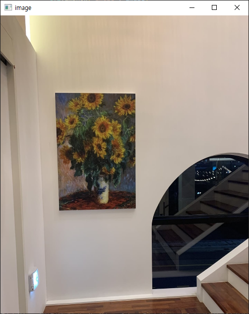
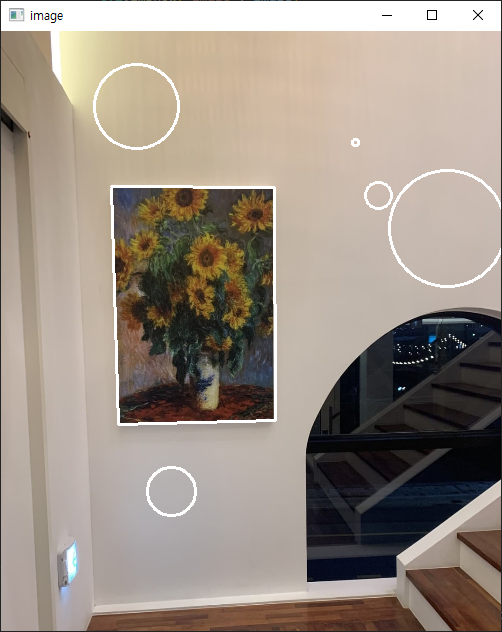

# Mouse Callback
> Depth를 구하기 위해서 이미지 내에 Line을 그릴 때 사용한 코드

## What is Mouse Callback
1. 매개 변수를 통해 다른 함수를 전달 받고, 이벤트가 발생할 때 매개변수에 전달된 함수를 호출하는 역할 
2. 윈도우에 마우스 이벤트가 발생했을 때, 특정한 함수에 이벤트를 전달해 실행

## How to use?
1. 이미지 창이 띄어지고, 기본설정은 라인이 그려진다.
2. m을 누르면 mode 변경이 되는데, 동그라미가 그려진다. 
3. 스크롤 업을 하면 동그라미의 크기가 커지고, 스크롤 다운을 하면 동그라미 크기가 작아진다.

## install Library
```
pip install opencv-python
```

## Example
|
