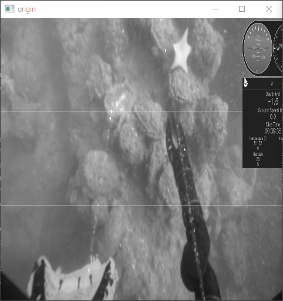
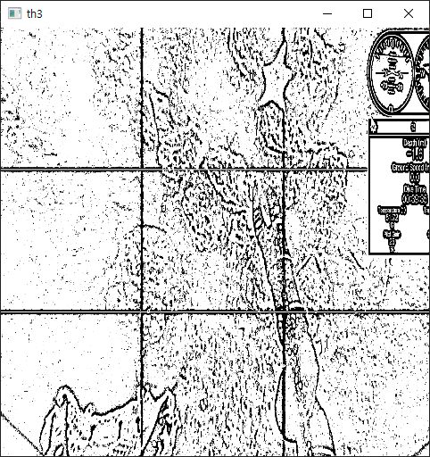

# Adaptive_Threshold
> 임계값을 통해 레이저가 있는 부분만 필터링 시도

## What is Threshold?
1. 이진화란 영상을 흑/백으로 분류하여 처리하는 것을 말한다.
2. 이때 기준이 되는 임계값을 어떻게 결정할 것인지가 중요한 문제가 된다.
3. 임계값보다 크면 백, 작으면 흑이 된다.

## install Library
```
pip install opencv-python
```

## Example





