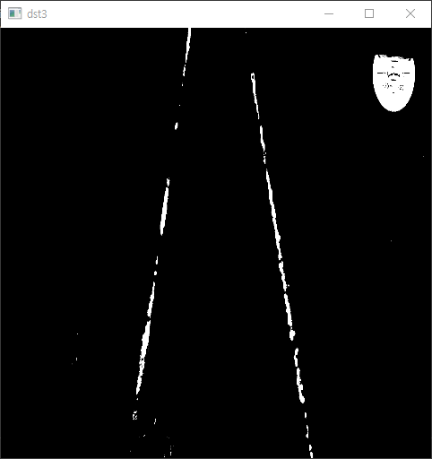

# Color_Extraction
> 레이저를 추출하기 위해서, 필터를 생성

## How to use?
1. 이미지에 따라 필터를 설정하고, 
2. 레이저가 있는 부분이 일부 탐지가 되나, 완벽한 탐지는 어려움

## install Library
```
pip install opencv-python
```

## Example

### (60, 40, 40) ~ (90, 255, 255)

### (30, 110, 110) ~  (100, 255, 255)

### bitwise_or(filter1, filter2)

