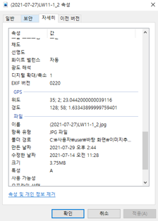
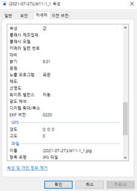

# Extract_NonGPS
> 사진중 GPS 정보가 없는 사진 추출

## How to use?
1. 사진 exif정보를 불러와서 위경도 좌표가 없는 사진 추출
2. 같은 세트의 xml 파일도 추출
3. 위 내용을 GUI 버전으로 구현

## install Library
```
pip install pillow
pip install pytest-shutil
pip install PySimpleGUI
```
## Example
 | 
