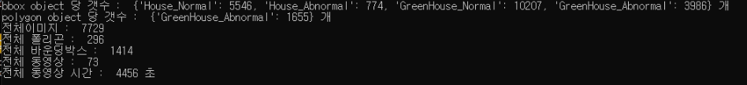

# Labeling_Progress_Check
> 라벨링 작업 진행을 체크하기 위한 코드

## How to work?
1. 디렉터리를 순차적으로 탐색
2. Bbox 오브젝트 갯수, Polygon 오브젝트 갯수
3. 전체 이미지 갯수, 작업 완료된 폴리곤, 바운딩 박스, 전체 동영상, 전체 동영상 시간등의 정보가 나옴 

## Example_Image
---
### Result
