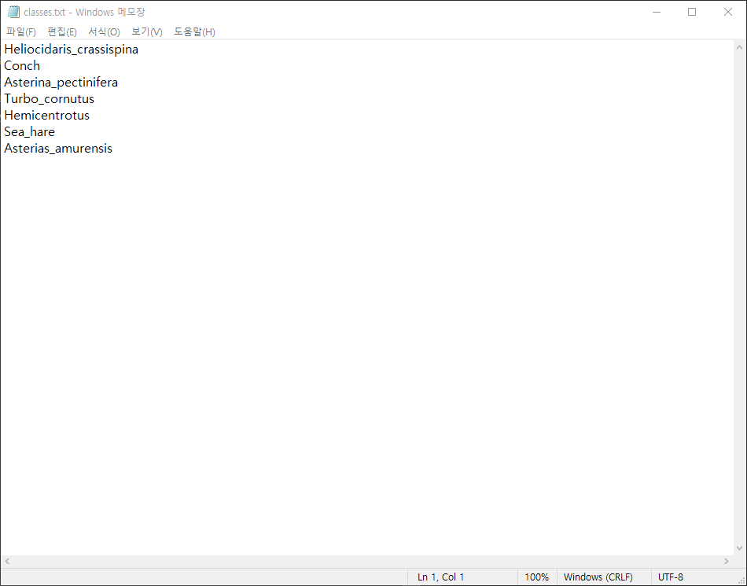
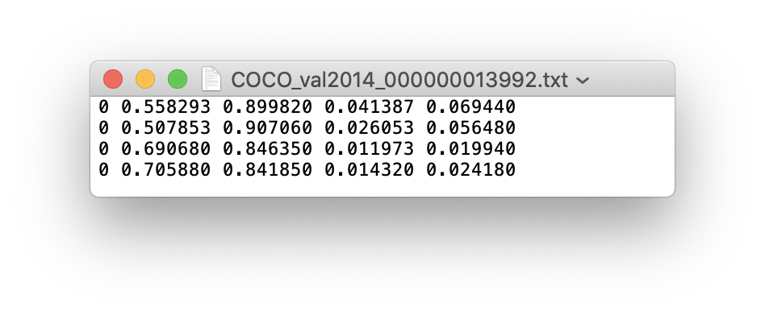
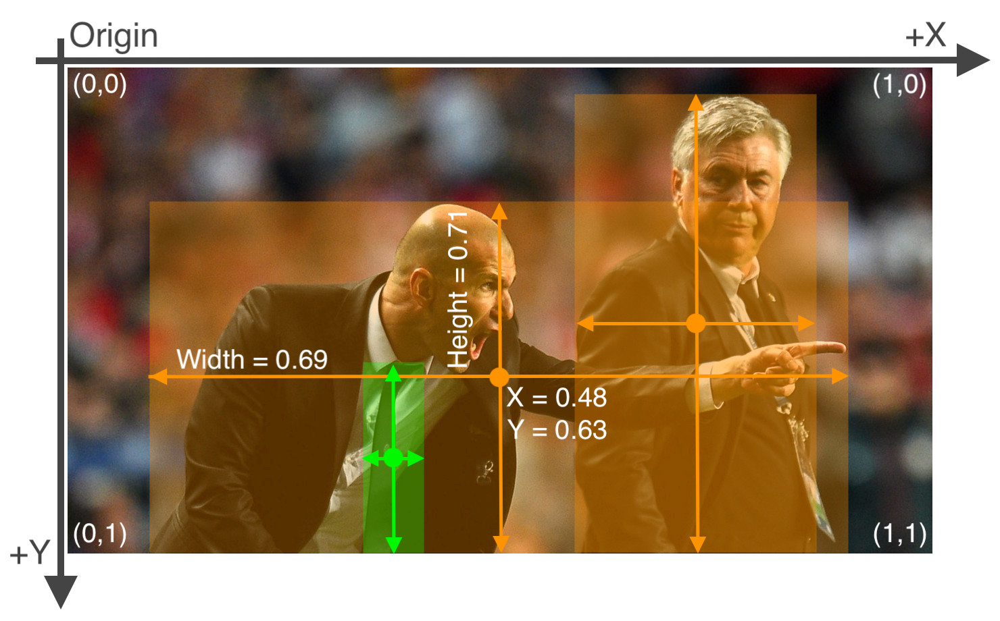

# JSON_to_YOLO
> labelme로 라벨링해서 생성된 JSON파일을 Detection 모델에 사용하기 위해 YOLO 데이터셋 형식으로 바꾸는 작업

## How to use?
1. classes.txt 파일 생성
2. json 파일의 points를 불러와서 
3. 바운딩박스의 중심점, 높이, 너비를 구하고
4. 이미지 전체가로, 세로로 나눠준다. 

## Example
### classes.txt 예시

### txt파일 예시

### XYWH 예시
