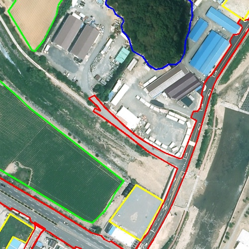
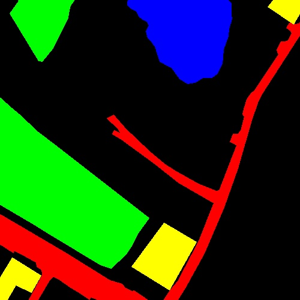

# Make_Line_Mask
> 시각화 할때 쓰는 도구

## How to use?
1. 라벨링한 이미지를 들고와서 원하는 위치 선정
2. 이미지에 라인으로 폴리곤을 그리고
3. mask로 면적 시각화

## install Library
```
pip install opencv-python
pip install numpy
pip install copy
```
## Example
### Origin

### Line_Origin

### Mask
